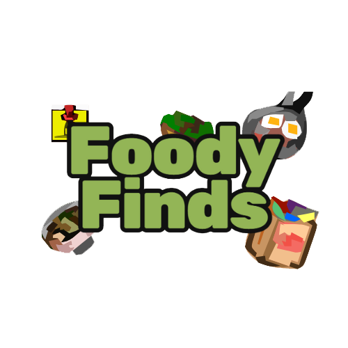

# Foody Finds - Gerador de Receitas

> ## Projeto de conclusão do módulo de HTML, CSS e JavaScript do curso **Jovem Tech**
> ### Participantes
>
> **Albérico** -> Front-End
>
> **Kaylane** -> Full-Stack
>
> **Matheus Guimarães** -> Back-End
>
> **Ryan** -> Back-End
>
> **Rodolfo Melo** -> Scrum Master/Full-Stack
>
> ### Professor: **Wallace Oliveira**

## Tecnologias

> **HTML 5**
>
> **CSS**
>
> **JavaScript**
>
> **Spoonacular API**

## Objetivos

> **Consumir a Spoonacular API**
>
> **Incluir receitas com os ingredientes digitados pelo usuario**
>
>
>
> **Spoonacular API**

